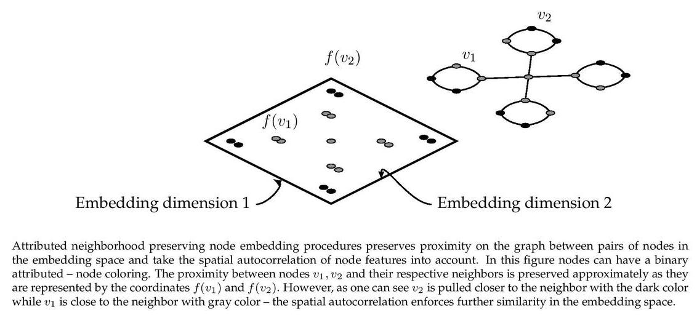

ASNE
======================
[](https://arxiv.org/abs/1705.04969) [](https://codebeat.co/projects/github-com-benedekrozemberczki-asne-master) [](https://github.com/benedekrozemberczki/ASNE/archive/master.zip)⠀[](https://twitter.com/intent/follow?screen_name=benrozemberczki)⠀

<p align="justify">
An implementation of "Attributed Social Network Embedding". ASNE is a graph embedding algorithm which learns an embedding of nodes and fuses the node representations with node attributes. The procedure places nodes in an abstract feature space where information aboutfrist order proximity is preserved and attributes of a node are also part of the representation. ASNE learns the joint feature-proximal representations using a probabilistic factorization model. In our implementation we assumed that the proximity matrix used in the approximation is sparse, hence the solution runtime can be linear in the number of edges. The model assumes that the node-feature matrix is sparse. Compared to other implementations this specific version has several advantages. Specifically:

1. Stores the feature matrix as a sparse dictionary.
2. Uses sparse matrix multiplication to speed up computations.</p>
<div style="text-align:center"></div>

This repository provides an implementation for ASNE as described in the paper:

> Attributed Social Network Embedding.
> Lizi Liao, Xiangnan He, Hanwang Zhang, Tat-Seng Chua
> IEEE Transactions on Knowledge and Data Engineering, 2018.
> https://arxiv.org/abs/1705.04969

A dense **TensorFlow** implementation is available [[here]](https://github.com/lizi-git/ASNE).

----------------------------

### Requirements

The codebase is implemented in Python 3.5.2 | Anaconda 4.2.0 (64-bit). Package versions used for development are just below.
```
networkx          2.4
tensorflow-gpu    1.12.0
tqdm              4.19.5
numpy             1.15.4
pandas            0.23.4
texttable         1.5.0
scipy             1.1.0
argparse          1.1.0
```
### Datasets
<p align="justify">
The code takes an input graph in a csv file. Every row indicates an edge between two nodes separated by a comma. The first row is a header. Nodes should be indexed starting with 0. Sample graphs for the `Wikipedia Chameleons` and `Wikipedia Giraffes` are included in the  `input/` directory. </p>
<p align="justify">
The feature matrix is a **sparse binary** one it is stored as a json. Nodes are keys of the json and features are the values. For each node feature column ids are stored as elements of a list. The feature matrix is structured as:</p>

```javascript
{ 0: [0, 1, 38, 1968, 2000, 52727],
  1: [10000, 20, 3],
  2: [],
  ...
  n: [2018, 10000]}
```

### Options
<p align="justify">
Learning of the embedding is handled by the `asne_src/main.py` script which provides the following command line arguments.</p>

#### Input and output options

```
  --edge-path     STR       Input graph path.           Default is `input/edges/chameleon_edges.csv`.
  --features-path STR       Input Features path.        Default is `input/features/chameleon_features.json`.
  --output-path   STR       Embedding path.             Default is `output/chameleon_asne.csv`.
```

#### Model options

```
  --node-embedding-dimensions      INT        Number of node embeding dimensions.           Default is 16.
  --feature-embedding-dimensions   INT        Number of feature embeding dimensions.        Default is 16.
  --batch_size                     INT        Batch size for gradient descent.              Default is 64.
  --epochs                         INT        Number of training epochs.                    Default is 10.
  --alpha                          FLOAT      Matrix mixing parameter for embedding.        Default is 1.0.
  --negative_samples               INT        Number of negative samples.                   Default is 10.
```

### Examples
<p align="justify">
The following commands learn a graph embedding and write the embedding to disk. The node representations are ordered by the ID.</p>
<p align="justify">
Creating an ASNE embedding of the default dataset with the default hyperparameter settings. Saving the embedding at the default path.</p>

```
python asne_src/main.py
```
Creating an ASNE embedding of the default dataset with 2x128 dimensions.

```
python asne_src/main.py --node-embedding-dimensions 128  --feature-embedding-dimensions 128
```

Creating an ASNE embedding of the default dataset with asymmetric mixing.

```
python asne_src/main.py --batch_size 512
```

Creating an embedding of another structured dataset the `Wikipedia Giraffes`. Saving the output in a custom folder.

```
python asne_src/main.py --edge-path input/edges/giraffe_edges.csv --features-path input/features/giraffe_features.json --output-path output/giraffe_asne.csv
```

--------------------------------------------------------------------------------

**License**

- [GNU License](https://github.com/benedekrozemberczki/ASNE/blob/master/LICENSE)

--------------------------------------------------------------------------------
